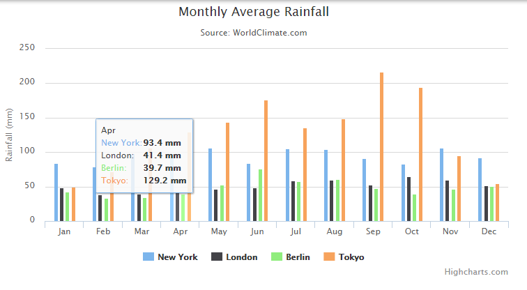
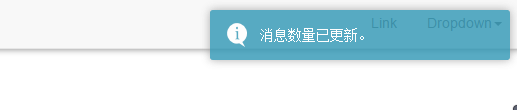
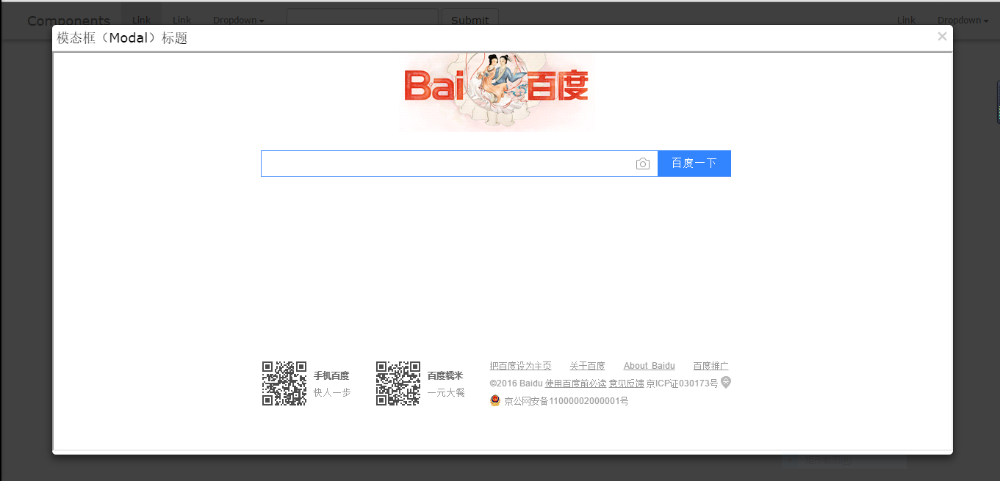

# 需求完成情况

### 需求列表

* ~~导航栏~~
* 列表/图标
* 树
* ~~统计图表~~
* ~~消息，自动更新消息数量~~
* 弹出菜单
* ~~自动提示框，不需要交互响应~~
* ~~弹出窗口浏览~~
* ~~大文件批量上传~~
* 收发邮件，富文本编辑器

### 导航栏

方案：Bootstrap

```js
// 引入js和css文件
<link href="http://apps.bdimg.com/libs/bootstrap/3.3.4/css/bootstrap.min.css" rel="stylesheet">
<script src="http://cdn.bootcss.com/bootstrap/4.0.0-alpha.3/js/bootstrap.min.js"></script>

<nav class="navbar navbar-default navbar-fixed-top" role="navigation">
  <div class="navbar-header"></div>
  <div class="collapse navbar-collapse"></div>
</nav>
```

效果：


### 列表/图标

方案：

效果：

### 树

方案：

效果：

### 统计图表

方案：[Highcharts](http://www.hcharts.cn/api/index.php)

```javascript
// 引入js文件
<script src="http://cdn.hcharts.cn/highcharts/highcharts.js"></script>

var chart = new Highcharts.Chart({

 chart: {
   renderTo: 'con', // 图标渲染的节点
   type: 'column'
 },
 title: {
   // 副标题
 },
 subtitle: {
   // 副标题
 },
 xAxis: {
   // 横坐标参数
 },
 yAxis: {
   // 纵坐标参数
 }
 tooltip: {
   // 鼠标划过图表时的参数
 },
 plotOptions: {
   // 其他样式设置
 },
 series: [{ // 数据源
   name: 'New York',
   data: [83.6, 78.8, 98.5, 93.4, 106.0, 84.5, 105.0, 104.3, 91.2, 83.5, 106.6, 92.3]
 }, {
   name: 'London',
   data: [48.9, 38.8, 39.3, 41.4, 47.0, 48.3, 59.0, 59.6, 52.4, 65.2, 59.3, 51.2]
 }, {
   name: 'Berlin',
   data: [42.4, 33.2, 34.5, 39.7, 52.6, 75.5, 57.4, 60.4, 47.6, 39.1, 46.8, 51.1]
 }]
 })
```

效果：



### 消息

方案：bootstrap &gt; badge

```javascript
<a class="message">消息 <span class="badge">5</span></a>
```

效果：

### 弹出菜单

方案：

效果：

### 提示框

方案：[Toastr](https://github.com/CodeSeven/toastr)

```javascript
// Display an info toast with no title
toastr.info('Are you the 6 fingered man?')

// Display a warning toast, with no title 
toastr.warning('My name is Inigo Montoya. You killed my father, prepare to die!')

// Display a success toast, with a title 
toastr.success('Have fun storming the castle!', 'Miracle Max Says')

// Display an error toast, with a title 
toastr.error('I do not think that word means what you think it means.', 'Inconceivable!')

// Immediately remove current toasts without using animation 
toastr.remove()

// Remove current toasts using animation 
toastr.clear()
```

效果：



### 浮动窗口浏览

方案：bootstrap &gt; modal

```html
  <button type="button" class="btn btn-success btn-lg" data-toggle="modal" data-target="#myModal">悬浮窗</button>
  <div class="modal fade" id="myModal" tabindex="-1" role="dialog" aria-labelledby="myModalLabel" aria-hidden="true">
    <div class="modal-dialog">
      <div class="modal-content">
        <div class="modal-header">
          <button type="button" class="close" data-dismiss="modal" aria-hidden="true">
                          &times;
                    </button>
          <h4 class="modal-title" id="myModalLabel">
            模态框（Modal）标题
          </h4>
        </div>
        <div class="modal-body">
          <iframe src="http://www.baidu.com" width="100%" height="100%" />
        </div>
      </div>
    </div>
  </div>
```

效果：



### 文件批量上传

方案：[Stream上传插件](http://www.twinkling.cn/)

```javascript
    <link href="./css/stream-v1.css" rel="stylesheet">
    <script src="./js/stream-v1.js"></script>
```

相关参数配置：

```javascript
    /**
     * 配置文件（如果没有默认字样，说明默认值就是注释下的值）
     */
    var config = {
        browseFileId: "i_select_files", /** 选择文件的ID, 默认: i_select_files */
        browseFileBtn: "<div class='btn btn-default'>请选择文件</div>", /** 显示选择文件的样式, 默认: `<div>请选择文件</div>` */
        dragAndDropArea: "i_select_files", /** 拖拽上传区域，Id（字符类型"i_select_files"）或者DOM对象, 默认: `i_select_files` */
        dragAndDropTips: "<span>把文件(文件夹)拖拽到这里</span>", /** 拖拽提示, 默认: `<span>把文件(文件夹)拖拽到这里</span>` */
        filesQueueId: "i_stream_files_queue", /** 文件上传容器的ID, 默认: i_stream_files_queue */
        filesQueueHeight: 150, /** 文件上传容器的高度（px）, 默认: 450 */
        messagerId : "i_stream_message_container", /** 消息显示容器的ID, 默认: i_stream_message_container */
        multipleFiles: true, /** 多个文件一起上传, 默认: false */
        autoUploading: false, /** 选择文件后是否自动上传, 默认: true */
        autoRemoveCompleted: true, /** 是否自动删除容器中已上传完毕的文件, 默认: false */
        maxSize: 104857600//, /** 单个文件的最大大小，默认:2G */
        retryCount : 5, /** HTML5上传失败的重试次数 */
        postVarsPerFile : { /** 上传文件时传入的参数，默认: {} */
          param1: "val1",
          param2: "val2"
        },
        swfURL: "swf/FlashUploader.swf", /** SWF文件的位置 */
        tokenURL: "php/upload.php?action=tk", /** 根据文件名、大小等信息获取Token的URI（用于生成断点续传、跨域的令牌） */
        frmUploadURL: "php/upload.php?action=fd;", /** Flash上传的URI */
        uploadURL: "php/upload.php?action=up", /** HTML5上传的URI */
        simLimit: 200, /** 单次最大上传文件个数 */
        extFilters: [".txt", ".rpm", ".rmvb", ".gz", ".rar", ".zip", ".avi", ".mkv", ".mp3"], /** 允许的文件扩展名, 默认: [] */

        onSelect: function (list) {//选择文件后的响应事件
            // TODO
        },
        onMaxSizeExceed: function (size, limited, name) {//文件大小超出的响应事件
            toastr.error("文件大小超出限制！");
        },
        onFileCountExceed: function (selected, limit) {//文件数量超出的响应事件
            toastr.error("文件数量超出限制！");
        },
        onExtNameMismatch: function (name, filters) {//文件的扩展名不匹配的响应事件
            toastr.error("不支持的文件类型！");
        },
        onCancel: function (file) {//取消上传文件的响应事件
            toastr.warning("文件上传取消。");
        },
        onComplete: function (file) {//单个文件上传完毕的响应事件
            // TODO
        },
        onQueueComplete: function () {//所以文件上传完毕的响应事件
            toastr.success("文件上传完成。");
        },
        onUploadError: function (status, msg) {//文件上传出错的响应事件
            toastr.error("文件上传出错！");
        }
    };
    var _t = new Stream(config);
```
效果：


### 富文本编辑器 

方案：[UEditor](http://fex.baidu.com/ueditor/)

效果：

